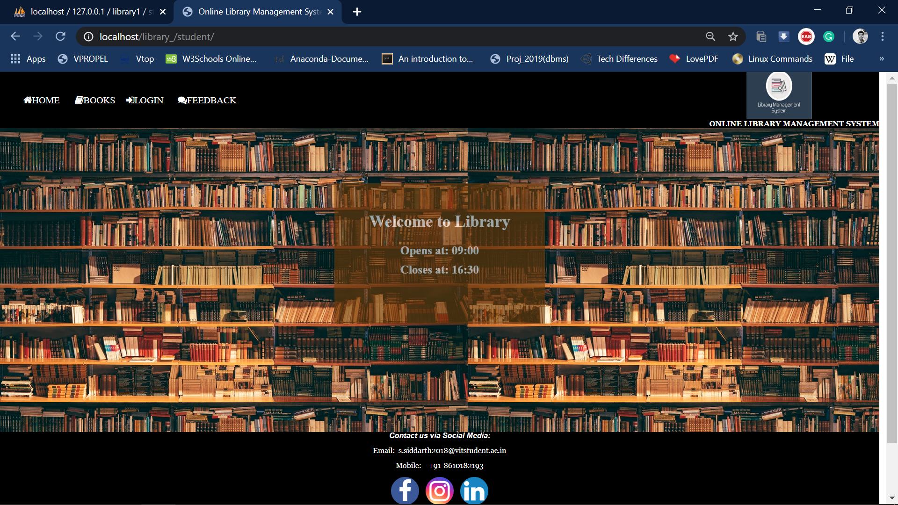

# :books: Online Library Management System
The Library Management System is a software built to handle the primary housekeeping functions of a library which help libraries keep track of their books, members' feedback and profiles. It also maintains a database for entering new books and recording books that have been borrowed with their respective due dates.

## Motivation
This is a step taken for borrowers to view the books available in the library online especially in scenarios where they cannot have direct access to the library due to Covid like situations. Thus this management system helps people  with an user account to get access to all the library stock information and borrow their books online.

## Screenshot

## Tech used
1. HTML
2. CSS
3. PHP
## Setup:
1) Download **Xampp** which allows you to build the website on a local web server on your computer.
2) Navigate into the xampp folder to locate *htdocs*.
3) Create a new folder inside it and paste the *src* files.
4) Launch the xampp control pannel and start *Apache* and *MySQL* modules.
5) Type localhost:*{port number}* on your website.**default: 80**
6) Open phpmyadmin 
    * Create Database library
    * Import database library2.sql 

## Thanks
*[Shreyas Madhav A V](https://github.com/Shreyas-Madhav)* and *Chandra Prakash* for contributing towards this project.
